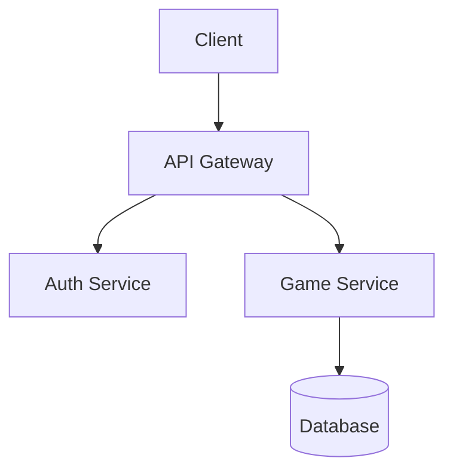

<!-- TEMPLATE_PLACEHOLDER: Add design artifacts here -->

# Vision & Design Artifacts

> **Purpose**: Store mockups, wireframes, and architecture diagrams that guide implementation. "Begin with the end in mind."

## Directory Structure

```
vision/
├── README.md           # This file
├── mockups/            # UI/UX designs
│   ├── *.png/jpg       # Static mockups (AI-generated, Figma exports, etc.)
│   └── *.md            # Mockup descriptions and context
└── architecture/       # System design
    ├── *.md            # Architecture decision records (ADRs)
    └── *.png/svg       # Diagrams (use Mermaid for text-based)
```

## Creating Mockups

For game development or visual apps, generate mockups before coding:

1. **AI-Generated Images**: Use tools like:
   - ChatGPT/DALL-E for concept art
   - Midjourney for stylized visuals
   - Sora/Veo for gameplay video concepts
   
2. **Wireframes**: Use tools like:
   - Figma, Sketch, or similar
   - Excalidraw for quick sketches
   - ASCII/text diagrams for simple layouts

3. **Save with context**: Include a markdown file explaining each mockup

## Example Mockup Description

```markdown
# Main Menu Mockup

**File**: main-menu-v1.png  
**Created**: 2024-01-15  
**Tool**: ChatGPT DALL-E

## Description
Dark fantasy theme with glowing runes. Center logo with three options:
- New Game (prominent)
- Continue (if save exists)
- Settings (smaller, bottom)

## Design Notes
- Color palette: Deep purple (#1a0a2e), Gold accents (#ffd700)
- Font: Medieval/runic style
- Animation: Subtle particle effects (floating embers)

## Implementation Notes
- Use CSS animations for particles (no canvas needed)
- Logo should be SVG for scaling
```

## Architecture Diagrams

Use Mermaid for version-controlled diagrams:



## Current Artifacts

<!-- Add links/descriptions as artifacts are created -->

No design artifacts yet. Add mockups to `mockups/` and diagrams to `architecture/`.
